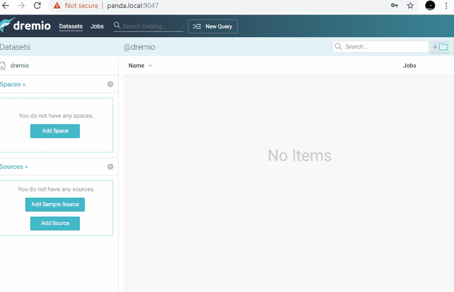

# Dremio Snowflake Connector

Overview
-----------

This is a community based Snowflake Dremio connector made using the ARP framework.

Demo
-----------

Quick Download
-----------

* To download a release, [click here](https://github.com/narendrans/dremio-snowflake/releases)

Building and Installation
-----------

1. In root directory with the pom.xml file run `mvn clean install`
2. Take the resulting .jar file in the target folder and put it in the <DREMIO_HOME>\jars folder in Dremio
3. Download the Snowflake JDBC driver from (https://mvnrepository.com/artifact/net.snowflake/snowflake-jdbc/3.8.6 and click on the JAR link) and put in in the <DREMIO_HOME>\jars\3rdparty folder
4. Restart Dremio

## Creating a new Snowflake Source

### Required Parameters

* Account name 
    * A quick way to get this is to copy it from the URL - https://<ACCOUNT NAME>.snowflakecomputing.com/
* Username, Password
    * The username and password with which you want to connect to Snowflake 
